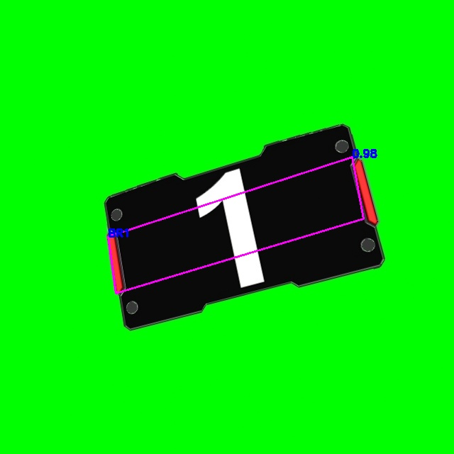

# PaddleDetection_RM

本项目利用PaddleDetection套件开发，能在aistudio上训练和测试，有利于无GPU服务器的开发者学习和使用。
项目地址：https://aistudio.baidu.com/aistudio/projectdetail/4667046?sUid=55227&shared=1&ts=1665239236531

## PaddleDetection简介

PaddleDetection是基于飞桨PaddlePaddle的端到端目标检测套件，提供多种主流目标检测、实例分割、跟踪、关键点检测算法，目前推出多种服务器端和移动端工业级SOTA模型，并集成了模型压缩和跨平台高性能部署能力,能帮助开发者更快更好完成端到端全开发流程。

- Github地址：https://github.com/PaddlePaddle/PaddleDetection
- Gitee地址：https://gitee.com/PaddlePaddle/PaddleDetection

## 四点模型介绍

本项目是在去年国庆开始修改的，基本的实现在今年1月份完成，之后由于毕设、实习、工作等原因没有太多的精力完善和标注数据集，所以本项目处于未完全完善的初代品，未经真实数据集测试，希望有热心的队伍能帮忙用真实数据集测试一下，十分感谢。

趁今年国庆假期的休息时间，整理了项目的代码，利用射影变换生成多角度的装甲板数据集用于测试。其中，数据集中四点顺序和上交大一样。

本四点模型训练所需的数据集为VOC格式，其中object下的bbox(x,y,w,h)改为gt_poly(x1,y1,x2,y2,x3,y3,x4,y4)。

四点坐标是基于中心点的偏移得出的，即head的通道为x, y, w1, h1, w2, h2, w3, h3, w4, h4, obj, cls。

## 识别效果展示

## 许可证书

本项目的发布受[GNU AGPL3.0 License](https://www.gnu.org/licenses/agpl-3.0.en.html)许可认证。
